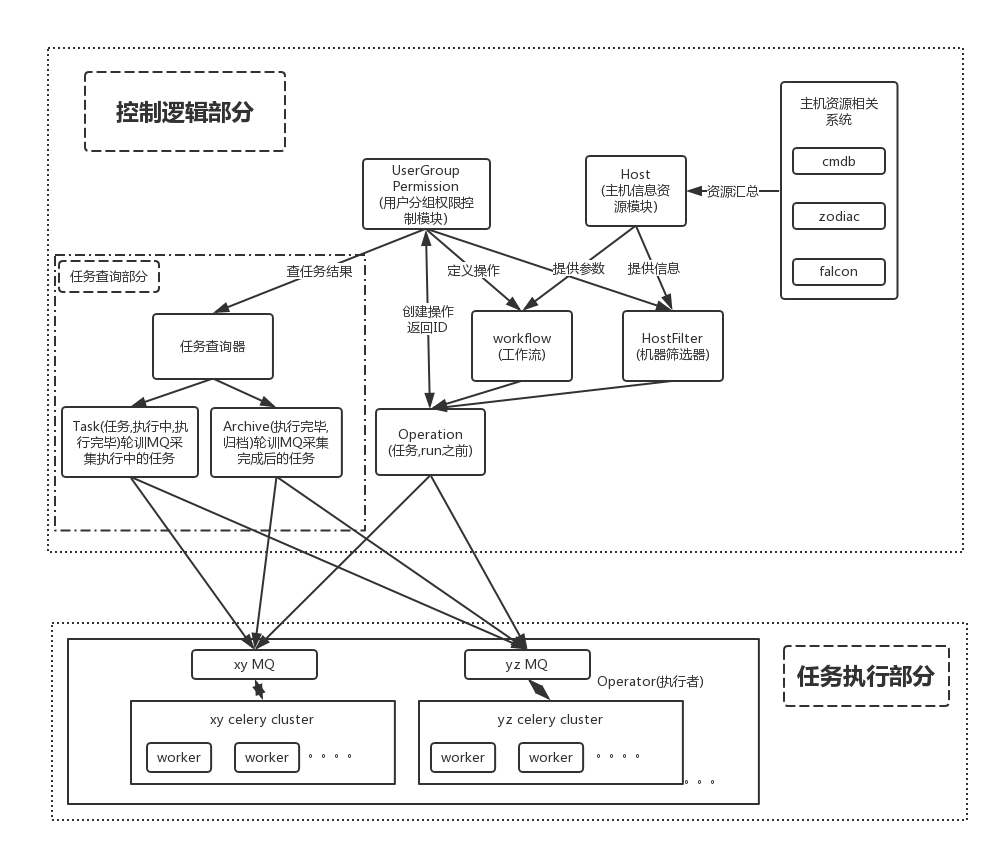

### 设计初衷：
> 做这个东西是因为跑一个在全网两个机房加起来三四千主机上面同步跑的脚本，写了一大堆的东西，而且跑起来效果不是很好.
     具体表现为：
+ 任务编排不够灵活。
+ 任务状态查询，fix异常不够智能。
+ 对大并发下的任务异常处理考虑不周全。
>后面还有一车的乱七八糟东西，不一一列举。 为了应对这种需求（大批量多并发，在一定时间内快速返回的任务需求），
以及能想的到的其他类似需求，我决定做一个专门针对这类需求的系统，对所有有这类需求的用户提供稳定的统一的服务，好吧，这个想法在脑袋里形成后就一发不可收拾了。产生了做一个操作中心的想法。

>基于以上情况： 得到我理解的需求，加以抽象，需求是这样的：  对某一批符合我条件的机器xxx执行一些yyy操作，并返回结果。

### 概要设计：
>首先起个名字吧。  op-center <操作中心> ，有名字再说起来就舒服多了。  
>有图有真相，先上图，看个大概再说：
 

>具体来说，我把操作中心设计成可独立使用拓展的上下两部分：
+ 上层部分： 控制逻辑，主要负责按照需求生成可执行的任务传给下层，和把下层的执行结果返回给用户方。
+ 下层部分： 执行逻辑，负责把上层推送过来的任务消费执行掉，保证对每个任务都返回一个结果。

###执行模块选型：
>看官们应该都不是很关心这个。简单几句略过吧，     
python-celery-paramiko去实现 开源的框架可以直接拽过来用。可以横向拓展。  
三四千机器一起跑没啥压力。1W没试过应该也没啥问题（截止我写设计文档时候cmdb主机量：9970，待测试）。所有任务的状态都在消息队列里（MQ 或者redis， 等等都可以）     
这里用redis。这个消息中间件也是和上层控制逻辑通信的中间人。

>补充： 1W机器也测试过了，只要后端celery够多，效率就高。

###控制逻辑粗略设计：
>这一层负责给执行层分派任务并选择一个合适的执行者去搞定这些操作。      
>如图， 控制逻辑拆分成了很多小的功能块儿，一个一个说。 

* Host：
>把主机信息收集起来放到这里（包括cmdb信息，issystem信息，后续可能还有openfalcon的时时信息）

* User + Group + Permission ： 
>把这三个放一起说，每个系统都差不多的东西，控制用户分组和权限，是操作发起的入口。

* Workflow： 
>工作流，这个东西作为任务的主体，定义了用户想做什么操作，需要用户自己去按照规则写一个workflow文件（做出来应该是一个精简的不能再精简的类似saltstack的state的样子），实际上在每个目标主机上跑的都是这个里头定义的东西， Host的信息也会作为固定参数传给workflow。

* HostFilter： 
>主机筛选器， 负责按照用户的描述，筛选出目标主机， 用户自己写规则想要1批符合什么规则的主机。输出就是1堆符合规则的主机。

* Operator： 
>执行者，虽然不是这一层的，就这么凑乎看吧。系统做完后会部署一批执行者集群，计划每个机房环境来1套。这里的operator是执行者的入口实例。

* Operation： 
>任务执行前的最终形态，就差执行了。 再看一下需求：对某一批符合我条件的机器xxx执行一些yyy操作，并返回结果。  
>有三个要素：     
>1： 对谁操作 （写个HostFilter，帮你筛选出目标主机）   
>2： 做什么操作 （写个Workflow，定义需要做的操作）     
>3： 谁去怎么做（选个执行者帮你把这活干了，这个用户不关心不在需求内，但很关键）              
所以，需要三个东西初始化Operation(HostFilter, Workflow, Operator) ，把这个丢给下层的Operator就可以执行了

* Task：
>任务，Operation执行后就会变成Task，每个task都在下层执行逻辑内有对应的消息体，下层执行者会不断更新这个任务的状态直到结束。

* Archive： 
>任务执行完毕后，归档到这里保存。